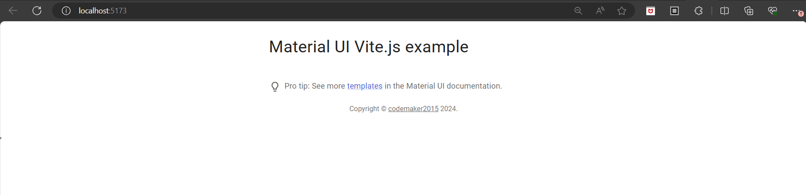

# Material UI - Vite.js example



## How to use

Install it and run:

```bash
npm install
npm run dev
```

## The idea behind the example

This example uses [Vite.js](https://github.com/vitejs/vite).
It includes `@mui/material` and its peer dependencies, including [Emotion](https://emotion.sh/docs/introduction), the default style engine in Material UI v5.

## What's next?

<!-- #default-branch-switch -->

You now have a working example project.
You can head back to the documentation and continue by browsing the [templates](https://mui.com/material-ui/getting-started/templates/) section.
